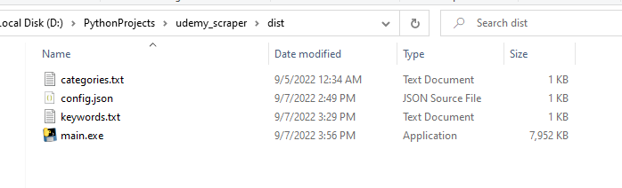
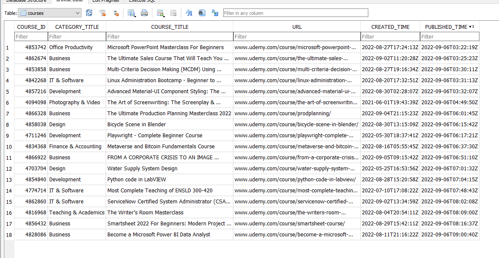

# Udemy Scraper

Scrape new courses from udemy

## Description

A simple cmd program to scrape all new courses added in udemy for the specified keywords, categories of your choice

## Getting Started

### Dependencies

* [requests](https://pypi.org/project/requests/) library
* [sqlite3](https://pypi.org/project/pysqlite3/) library

you can install the libraries needed by simply running the command
```
pip install -r requirements.txt
```

and if you face any problems you can install the libraries individually
```
pip install requests
```
```
pip install pysqlite3
```

## Installing

* If you wish to turn the program into an exe

first make sure you have [pyinstaller](https://pyinstaller.org/en/stable/) installed on your pc

then you can head to the project directory and run this command on the terminal
```
pyinstaller --onefile main.py
```
after the command is done you can open the dist directory where you will find your main.exe program

now all that is left is to copy the "config.json", "categories.txt" and "keywords.txt" files to that directory 

the program should now be ready to launch



## Executing program

* You can run the bot simply by heading to the project directory and running the command
```
python main.py
```

* Or if you used pyinstaller you could simply run main.exe

### Help

* Search configs

You can specify all the keywords you would like to search in the file "keywords.txt" seperated by a newline

Same goes for the categories you can add them in "categories.txt" seperated by a newline

* Bot Configs

From the "config.json" file you can specify some settings to your liking

_db_name_ : the name you would like to give to the database

_keep_running_ : set as **(True)** to keep the bot running as long as you wish it to be or **(False)** if you want the bot to run only once

_finish_pause_time_ : if you set the the _keep_running_ to **(True)** you can choose the time between each run (by seconds its set to 10min by default)

_keyword_pause_time_ : the wait time between each keyword search to avoid getting IP banned

_pages_ : how many page to search through every keyword (100 is the max)

### Showcase

* All the courses will be saved into a SQL database



## License

This project is licensed under the [MIT] License - see the LICENSE.md file for details
